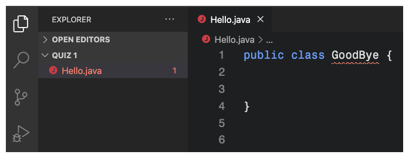
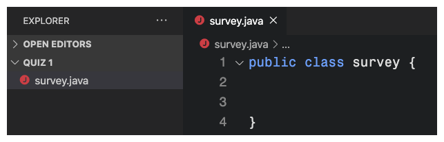
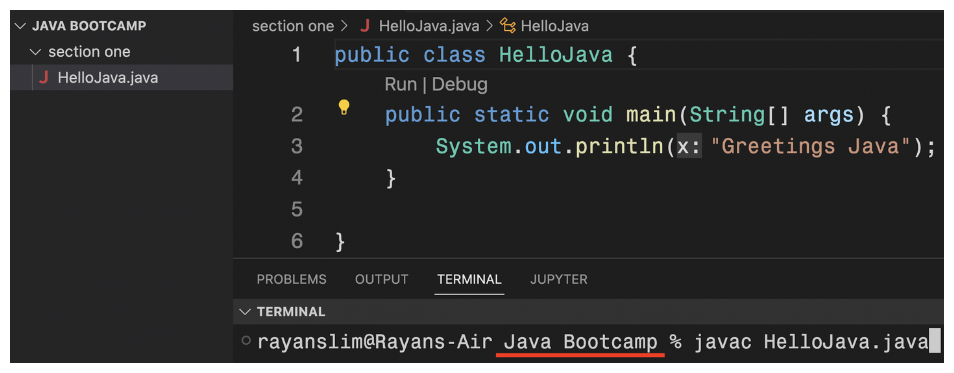

# QUIZ

1. How do you run previous terminal commands without re-writing them?
   - The up key
2. Why does this class get an error? 
   
   - The file name is not the same as the class name.
3. There is no error. But, do you see a problem?
   
   - The class name should be CamelCase.
4. What's the output of this code?
   ```java
        public class Survey {
            public static void main(String[] args) {
                System.out.println("Hi, what's your name?");
                System.out.println("How old are you?");
        
            }
        }
   ```
   - ```txt
     >> Hi, what's your name?
     >> How old are you?
     ```
   - `println()` prints each message on a new line.
5. This code doesn't compile. Why?
    ```java
        public class Survey {
            public static void main(String[] args) {
                System.out.println("Hi, what's your name?")
                System.out.println("How old are you?")
            }
        }
    ```
    - Missing semi-colons
    - Every line of code needs a semi-colon at the end.

6. This command:
   ```bash
        javac <file-name>.java
   ```
   - compiles the code
7. This command:
   ```bash
        java <file-name>
   ```
   - runs the compiled code
8. Will this terminal command work?
   
   - No. The terminal tries to compile a HelloJava.java file inside Java Bootcamp. There is no HelloJava.java file inside the /'Java Bootcamp' folder. The file is inside /'section one'.